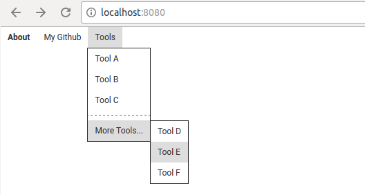

# inferno-menu-bar
A library of menu bar components for [Inferno](https://github.com/infernojs/inferno).



- Supports dropdowns and nested menus.
- Basic styling out of the box.
- Classes all over the place to let you CSS your heart out.

## Installation
`npm install --save inferno-menu-bar`

## Usage
```js
import { MenuBar, MenuItem, MenuLinkItem, Menu, MenuSeparator, MenuAnchorItem } from 'inferno-menu-bar';

const onSelect = command => console.log(`Selection: ${command}`);

const MyMenu = () => (
    <MenuBar onSelect={onSelect}>
        <MenuLinkItem to='/about'><strong>About</strong></MenuLinkItem>
        <MenuAnchorItem href='https://github.com/doytch' title='Weee'>My Github</MenuAnchorItem>
        <MenuItem label='Tools'>
            <Menu>
                <MenuItem command='A' className='tools-menu-item'>Tool A</MenuItem>
                <MenuItem command='B' className='tools-menu-item'>Tool B</MenuItem>
                <MenuItem command='C' className='tools-menu-item'>Tool C</MenuItem>
                <MenuSeparator />
                <MenuItem label='More Tools...'>
                    <Menu>
                        <MenuItem command='D'>Tool D</MenuItem>
                        <MenuItem command='E'>Tool E</MenuItem>
                        <MenuItem command='F'>Tool F</MenuItem>
                    </Menu>
                </MenuItem>
            </Menu>
        </MenuItem>
        <span className='status' />
    </MenuBar>
);
```

There's also a `webpack-dev-server` example that you can run with `npm install && npm run start`.


## Components

### MenuBar
The top-level component that actually creates the bar itself.

#### onSelect: `function(command)`
This function will get called every time a descendant `MenuItem` is clicked. The `command` argument's value will be the value of `command` for the clicked `MenuItem`.

### MenuItem
Used for JS callbacks and submenus.

`<MenuItem command='foo'>Foo</MenuItem>`

#### command: `string`
The value to pass to the `onSelect` callback.

#### unpadded: `boolean`
When `true`, adds a `menu-item__unpadded` class to the DOM node that removes the default padding in the styles.

`<MenuItem label='Opens a Menu'><Menu>...</Menu></MenuItem>`

#### label: `string`
Normally, a `MenuItem`'s children will be used for the label. However, if the children are supposed to be a `Menu`, use this property to set the label.

### MenuLinkItem
Used for links that should be created using `<Link>` components from `inferno-router`. Naturally, a `Router` needs to have been created somewhere in the parent chain for this to work.

`<MenuLinkItem to='/apage'>A Page</MenuLinkItem>`

#### unpadded: `boolean`
When `true`, adds a `menu-item__unpadded` class to the DOM node that removes the default padding in the styles.

#### Other Props
All props are passed directly to the `<Link>` created.

### MenuAnchorItem
Used for links that should be created using a raw `<a>` node.

`<MenuAnchorItem title='Weee' href='https://github.com/doytch'>My Github</MenuAnchorItem>`

#### unpadded: `boolean`
When `true`, adds a `menu-item__unpadded` class to the DOM node that removes the default padding in the styles.

#### Other props
All props are passed directly to the `<a>` created.

### Menu
Used to create a dropdown menu. Nest other components inside it.

### MenuSeparator
Creates an `<hr />` element.

## Requirements
- `inferno >= 3.0.0`
- `inferno-router >= 3.0.0`
